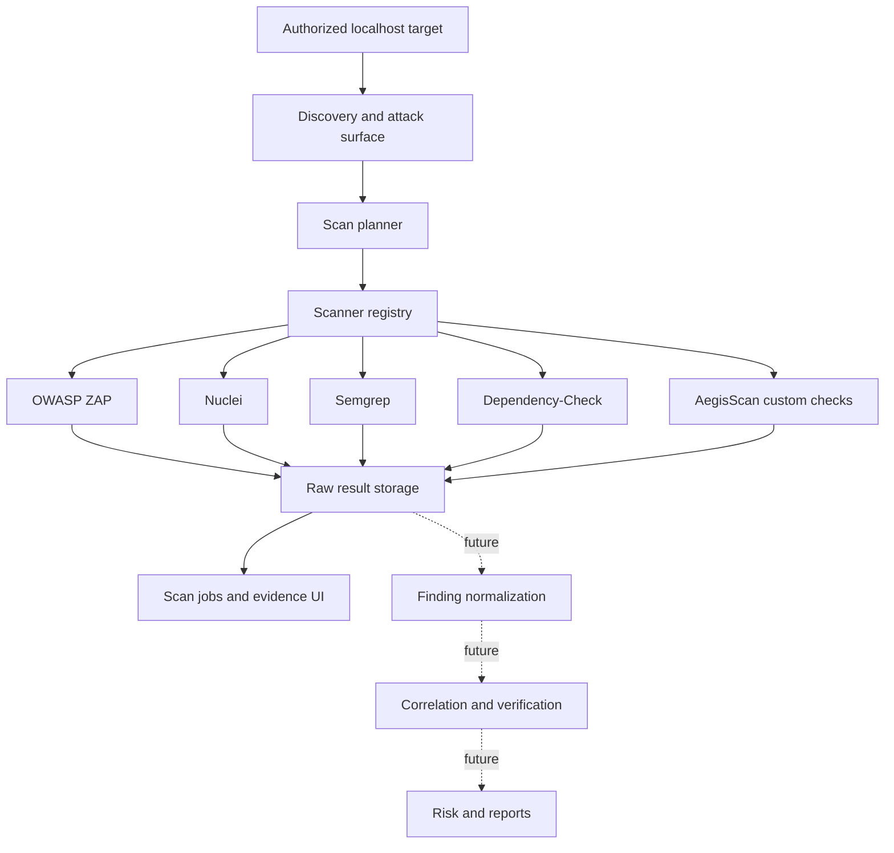

# Implemented Architecture

```mermaid
flowchart TD
  T[Authorized localhost target] --> D[Discovery and attack surface]
  D --> P[Scan planner]
  P --> R[Scanner registry]
  R --> Z[OWASP ZAP]
  R --> N[Nuclei]
  R --> S[Semgrep]
  R --> C[Dependency-Check]
  R --> U[AegisScan custom checks]
  Z --> X[Raw result storage]
  N --> X
  S --> X
  C --> X
  U --> X
  X --> UI[Scan jobs and evidence UI]
  X -. future .-> F[Finding normalization]
  F -. future .-> I[Correlation and verification]
  I -. future .-> Q[Risk and reports]
```

Solid arrows are current behavior. Dotted arrows are planned layers and must not be described as implemented during the demo.
