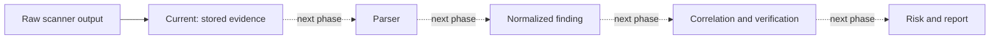

# Finding Lifecycle

```mermaid
flowchart LR
  A[Raw scanner output] --> B[Current: stored evidence]
  B -. next phase .-> C[Parser]
  C -. next phase .-> D[Normalized finding]
  D -. next phase .-> E[Correlation and verification]
  E -. next phase .-> F[Risk and report]
```
