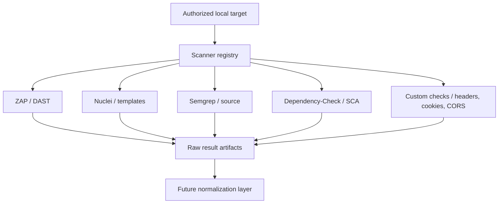

# Scanner Ecosystem

```mermaid
flowchart TB
  A[Authorized local target] --> R[Scanner registry]
  R --> Z[ZAP / DAST]
  R --> N[Nuclei / templates]
  R --> S[Semgrep / source]
  R --> D[Dependency-Check / SCA]
  R --> C[Custom checks / headers, cookies, CORS]
  Z --> O[Raw result artifacts]
  N --> O
  S --> O
  D --> O
  C --> O
  O --> U[Future normalization layer]
```
