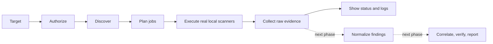

# Demo Workflow

```mermaid
flowchart LR
  A[Target] --> B[Authorize]
  B --> C[Discover]
  C --> D[Plan jobs]
  D --> E[Execute real local scanners]
  E --> F[Collect raw evidence]
  F --> G[Show status and logs]
  F -. next phase .-> H[Normalize findings]
  H -. next phase .-> I[Correlate, verify, report]
```
