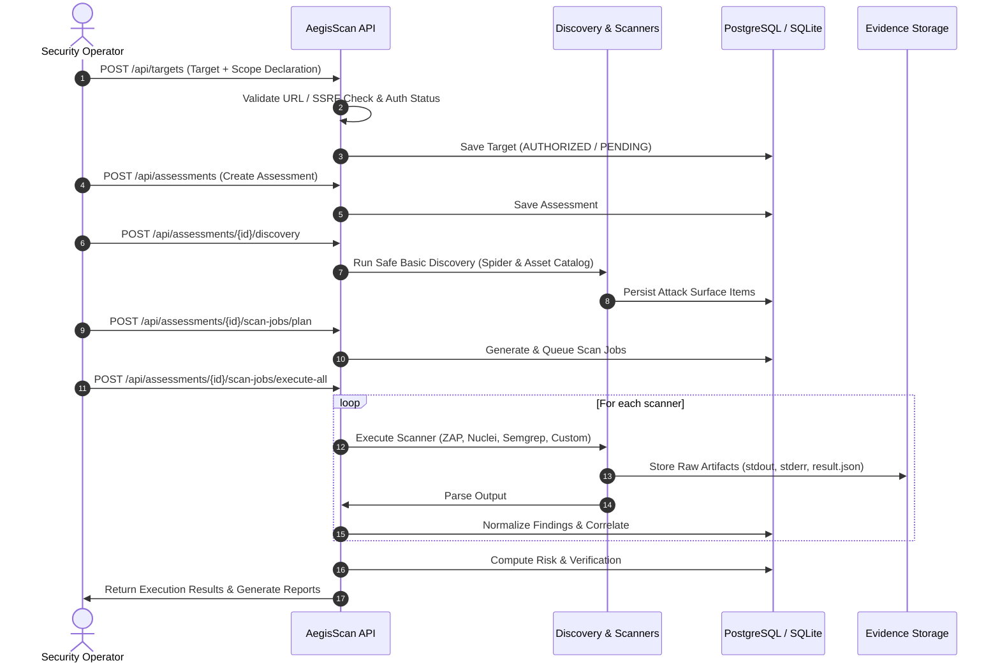

# AegisScan — Production Architecture & System Design

## 1. High-Level Architecture

AegisScan operates as an evidence-driven, multi-engine application security assessment and verification platform.

```text
                                  INTERNET / CLIENTS
                                          │
                                          ▼
                                   ┌──────────────┐
                                   │  HTTPS / TLS │
                                   │ (Nginx / ALB)│
                                   └──────┬───────┘
                                          │
                                          ▼
                        ┌───────────────────────────────────┐
                        │   Frontend (React 18 / Vite / CSS)│
                        └─────────────────┬─────────────────┘
                                          │
                                          ▼
                        ┌───────────────────────────────────┐
                        │   FastAPI Backend API & Gateway   │
                        │   - JWT Auth & Rate Limiting      │
                        │   - Security Headers & Middleware │
                        │   - Target & SSRF Validation      │
                        └─────────────────┬─────────────────┘
                                          │
                  ┌───────────────────────┼───────────────────────┐
                  ▼                       ▼                       ▼
          ┌──────────────┐        ┌──────────────┐        ┌──────────────┐
          │  PostgreSQL  │        │ Concurrency  │        │ Raw Evidence │
          │   Database   │        │  Semaphore   │        │ Storage Dir  │
          └──────────────┘        └──────┬───────┘        └──────────────┘
                                         │
                                         ▼
                             ┌───────────────────────┐
                             │   Scan Orchestrator   │
                             └───────────┬───────────┘
                                         │
          ┌──────────────────────────────┼──────────────────────────────┐
          ▼                              ▼                              ▼
    ┌───────────┐                  ┌───────────┐                  ┌───────────┐
    │ OWASP ZAP │                  │  Nuclei   │                  │  Semgrep  │
    │  (DAST)   │                  │ (Templates│                  │  (SAST)   │
    └─────┬─────┘                  └─────┬─────┘                  └─────┬─────┘
          │                              │                              │
          └──────────────────────────────┼──────────────────────────────┘
                                         ▼
                             ┌───────────────────────┐
                             │ Raw Evidence Storage  │
                             └───────────┬───────────┘
                                         ▼
                             ┌───────────────────────┐
                             │ Finding Normalizer &  │
                             │ Correlator (Zero Fake)│
                             └───────────┬───────────┘
                                         ▼
                             ┌───────────────────────┐
                             │ Verification & Risk   │
                             │ Engine (CVSS / Prior.)│
                             └───────────┬───────────┘
                                         ▼
                             ┌───────────────────────┐
                             │ Remediation Guidance  │
                             └───────────┬───────────┘
                                         ▼
                             ┌───────────────────────┐
                             │ Multi-Format Reports  │
                             │ (HTML, SARIF, JSON)   │
                             └───────────────────────┘
```

---

## 2. Component Breakdown

### 2.1 Backend Gateway & API Layer (FastAPI)
- **Framework**: FastAPI (Python 3.12) running under asynchronous Uvicorn workers.
- **Middleware**:
  - `SecurityHeadersMiddleware`: Enforces Content Security Policy (CSP), X-Frame-Options (`DENY`), X-Content-Type-Options (`nosniff`), Referrer-Policy, and HSTS.
  - `RateLimiterMiddleware`: Sliding-window token rate limiting per client IP to mitigate abuse and brute-force attempts.
  - `CORSMiddleware`: Strict origin whitelisting configured via `CORS_ORIGINS`.
- **Authentication**: JWT access tokens (PBKDF2-HMAC-SHA256 password hashing, 100,000 rounds).

### 2.2 Scan Planning & Orchestration Layer
- **ScanPlanner**: Analyzes target type, enabled modules, and discovered attack-surface assets to produce structured `ScanJob` records.
- **ScanOrchestrator**: Executes jobs asynchronously with concurrency control (`asyncio.Semaphore(max_concurrent_scans)`), isolation (failure of one scanner never blocks others), process timeout enforcement, and target authorization verification.

### 2.3 Evidence-Driven Findings Engine
- **Zero-Fabrication Policy**: Findings are derived exclusively from actual raw scanner output. If no scanner detects a vulnerability, findings remain zero.
- **Normalization & Correlation**: Standardizes heterogeneous outputs from ZAP, Nuclei, Semgrep, and Custom heuristics into normalized findings with fingerprints, CWE mappings, and evidence references.
- **Verification Engine**: Classifies findings into `VERIFIED`, `LIKELY`, `UNVERIFIED`, or `FALSE_POSITIVE` based on reproducible proof of exploitability.

### 2.4 Multi-Format Reporting Service
- Generates **HTML**, **SARIF 2.1.0** (for GitHub Security tab integration), and **JSON** assessment summaries.
- Prevents path traversal via strict root-boundary resolution and content hashing (`SHA-256`).

---

## 3. Data Flow Diagram


